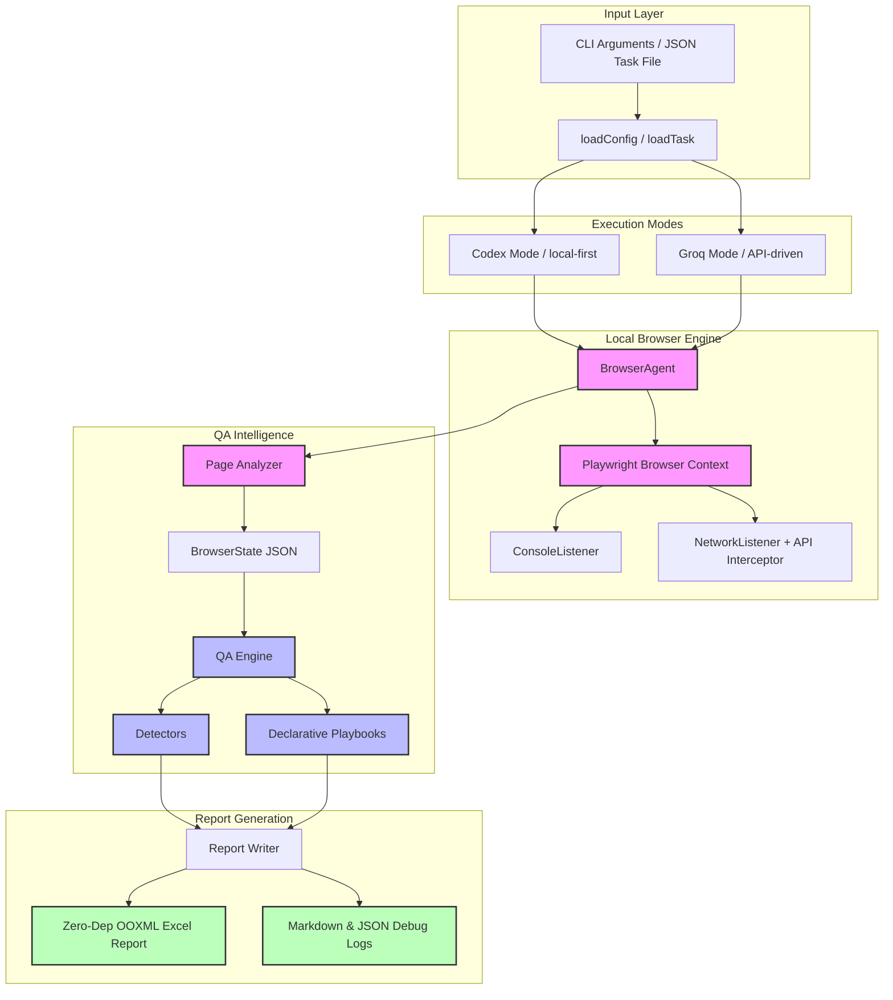

# QaAgent — System Architecture & Design Specification

This document details the engineering architecture, data flows, components, and design decisions of **QaAgent**, a professional-grade TypeScript + Playwright QA automation platform.

---

## 🗺️ System Topology & Execution Modes

QaAgent is built around a single, highly-instrumented local browser automation engine, supporting two reasoning interfaces:



### 1. Codex / no-API Mode
- **Rationale**: For local-first development where credentials/auth should never leave the machine.
- **Workflow**: Codex (running within the chat client) acts as the reasoning engine. The local `codex-driver` handles page initialization, explicit steps, autonomous exploration, and local detectors, writing rich evidence and reports locally.

### 2. Groq / API Mode
- **Rationale**: Fully autonomous standalone CLI tool loop.
- **Workflow**: A tool-use loop executes against a Groq model (e.g. `gpt-oss-120b`). The model chooses tool calls (e.g. click, fill, scroll, hover), and the browser agent executes them, handling recoveries and checking safety guards on each action.

---

## 📂 Source Code Mapping

The codebase is organized into modular directories under `agent/src/` to isolate automation, reasoning, intelligence, and reporting:

```text
agent/src/
├── api-agent/             # Groq tool loop definitions and client orchestration
│   ├── groq-client.ts
│   ├── groq-tool-definitions.ts
│   └── groq-tool-loop.ts
├── browser/               # Playwright orchestration and DOM analyzer
│   ├── actions.ts         # Maps command strings to browser method execution
│   ├── browser-agent.ts   # Unified browser context, state cache, actions
│   ├── console-listener.ts
│   ├── cypress-runtime.ts # Retryable assertions, failure screenshots, command log
│   ├── fixtures.ts        # Non-sensitive fixture lookup for task steps
│   ├── login-runner.ts    # Secure credential autofill and validation
│   ├── network-listener.ts# Collects network errors & intercepting API payloads
│   ├── page-analyzer.ts   # Computes accessible DOM representation
│   ├── recorder.ts        # Auditing browser actions for coverage verification
│   └── selector-healer.ts # Multi-strategy selector repair
├── codex-agent/           # Codex mode driver and autonomous exploration
│   ├── autonomous-explorer.ts # Navigates origins, tests pages/forms autonomously
│   ├── codex-driver.ts
│   ├── codex-report-helper.ts
│   └── codex-task-runner.ts
├── data/                  # Indian-style mock CRM lead data generators
│   └── lead-data.ts
├── memory/                # JSON file-backed local persistence layer
│   ├── selectors-memory.ts
│   ├── sites-memory.ts
│   └── test-history.ts
├── qa/                    # QA profiles, detectors, and playbooks
│   ├── detectors/         # Specialized DOM auditors
│   │   ├── accessibility-detector.ts
│   │   ├── form-detector.ts
│   │   ├── performance-detector.ts
│   │   └── table-detector.ts
│   ├── playbooks/         # Scope checklists
│   ├── checks.ts
│   ├── coverage.ts        # Formulates Pass/Partial/Fail based on action success
│   ├── flaky-rules.ts
│   ├── issue-detector.ts  # Aggregator for all detectors
│   ├── playbook-runner.ts
│   ├── priority-rules.ts
│   ├── qa-engine.ts
│   ├── risk-rules.ts
│   └── severity.ts
├── reports/               # Report generation templates
│   ├── excel.ts           # Hand-coded OOXML ZIP compiler
│   ├── json.ts
│   ├── markdown.ts
│   └── report-writer.ts
├── shared/                # Interfaces, utils, and safety guards
│   ├── safety-guard.ts    # Action-filtering firewall
│   ├── types.ts
│   └── utils.ts
└── config.ts              # Local settings parser
```

---

## 🛠️ Key Engineering Components

### 1. BrowserState Extractor (`page-analyzer.ts`)
Instead of feeding raw HTML or a full screenshot to the agent, the Page Analyzer compiles a highly structured **accessible DOM map** including:
- **Clickable Elements**: Evaluates focusable items, computing unique CSS selectors, roles, text names, tags, and coordinates. Every clickable element gets a simple integer index (`0-99`) for Groq tool execution.
- **Form Fields**: Structures inputs, labels, placeholders, validation hints, and submit associations.
- **Tables**: Parses rows, headers, cell matrices, and paginator elements.
- **Toasts and Modals**: Captures transient UI elements (success/error popups) separately.

### 2. Multi-Strategy Selector Healer (`selector-healer.ts`)
Selectors in web apps frequently change. When a selector fails during execution, the healer runs 4 sequential recovery layers:

```
[Target Selector fails]
        │
        ▼
1. Explicit Match ──► Locates element directly on active page (if successful -> Save in Memory)
        │ (failed)
        ▼
2. Memory Look-up ──► Checks previously healed selector history for this URL
        │ (failed)
        ▼
3. Role & Text   ──► Finds element using ARIA role & text hints (e.g. button:has-text("Submit"))
        │ (failed)
        ▼
4. Indexed Match  ──► Maps fallback matching using structural coordinates in browser state
        │ (failed)
        ▼
[Throw Selector Error / Mark Recoverable in Tool Loop]
```

### 3. Two-Tier Safety Guard (`safety-guard.ts`)
To prevent the agent from performing destructive actions in production/staging environments (such as bulk deletes, user invites, settings modifications, or real payments), the safety engine evaluates actions:
- **Safe Tool Whitelist**: Tools that only observe or perform standard form interaction (e.g., `open_url`, `click_by_index`, `scroll`, `hover`) bypass filters immediately, preventing false positives.
- **Intent Pattern Matching**: Unknown or custom tools are analyzed against safety rules (regex check) for action flags before execution. This prevents data fields (like entering `email: "delete-me@gmail.com"`) from triggering message-send blockages.

### 4. Cypress-Inspired Reliability Layer (`cypress-runtime.ts`)
QaAgent stays Playwright-native but adopts Cypress-style reliability patterns for explicit task steps:
- Query/assertion steps retry until a timeout and re-check the current DOM each attempt.
- Mutating actions are recorded as single-shot commands while Playwright handles actionability waits.
- Failed commands can capture a failure screenshot.
- Every explicit task command is written to a structured Command Log with status, attempts, duration, error, and screenshot path.
- Fixture references load reusable non-sensitive values from `agent/fixtures`.

### 5. Zero-Dependency OOXML Excel Builder (`excel.ts`)
To remain lightweight and portable, the Excel report generator uses **no external libraries** like `exceljs` or `xlsx`. It compiles raw OpenXML files directly:
- Writes structure files: `[Content_Types].xml`, `xl/styles.xml`, `xl/workbook.xml`, `xl/worksheets/sheet1.xml`, etc.
- Serializes screenshots into PNG files under `xl/media/` and writes `drawing.xml` elements to position screenshots inside cells.
- Standardizes styling: formats headers (purple background, bold white text), severity tiers (Red/Critical, Amber/High, Yellow/Medium, Blue/Low), and column widths.
- Bundles them using a lightweight, pure Node.js CRC32-based ZIP compiler.

### 6. Autonomous Explorer (`autonomous-explorer.ts`)
In Codex/no-API mode, the agent isn't passive. It crawls and checks sites dynamically:
- Locates navbar, sidebar, and tab navigation links.
- Explores linked pages (restricted to the same origin URL).
- Auto-detects forms, tests empty submit states, and runs validation auditors.
- Takes screenshots of each path and merges issues (deduplicated by title) into the report.

---

## ⚡ Execution Lifecycle

For every QA test execution:

```
1. Parse Arguments ──► 2. Initialize Playwright Context & Listeners
                                  │
                                  ▼
                       3. Execute Smart Login (if configured)
                                  │
                                  ▼
                       4. Execute Explicit Task Steps
                                  │
                                  ▼
                       5. Run Autonomous Explorer (crawls & fills)
                                  │
                                  ▼
                       6. Run QA Detectors & Playbooks
                                  │
                                  ▼
                       7. Compile Coverage Summary
                                  │
                                  ▼
                       8. Compile Excel Workbook + Media Zip
                                  │
                                  ▼
                       9. Update Site History & Memory
```

---

## 🚀 Future Roadmap & Optimizations

1. **Local LLM-Driven Selector Healing**: Integrate a fallback to query a local model to match a modified DOM node when structural heuristics fail.
2. **Visual Regression / Pixelmatch**: Capture visual baselines and diff screenshot outputs to highlight layout anomalies.
3. **Structured Logger**: Introduce a unified, JSON-formatted structured logging engine (like `pino`) for improved monitoring.
4. **Interactive Dashboard**: Build an HTML reporter utilizing charts to summarize historical run trends across test executions.
