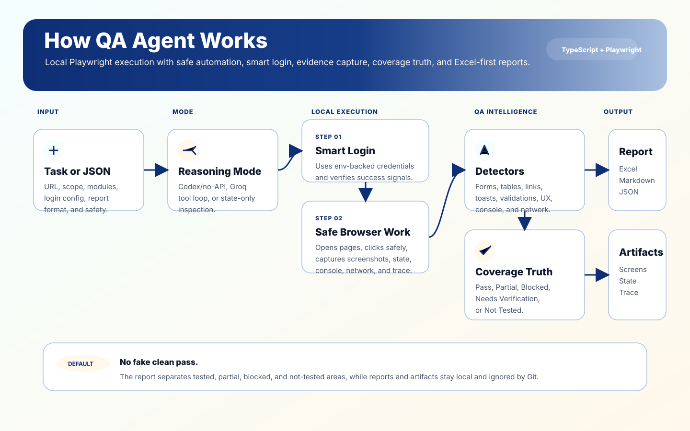
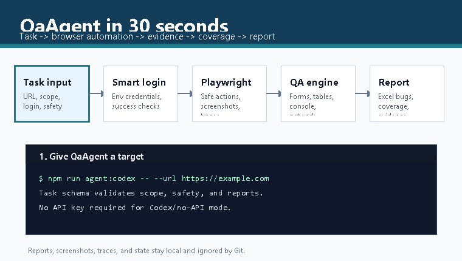
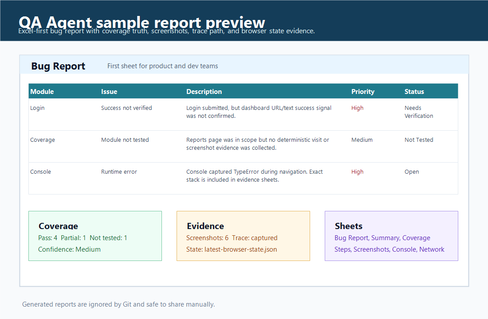

<p align="center">
  
</p>

<h1 align="center">QA Agent</h1>

<p align="center">
  TypeScript + Playwright QA automation for websites, CRM flows, auth journeys, forms, tables, console/network health, coverage truth, and Excel-first reports.
</p>

<p align="center">
  
  
  
  
  
</p>

## Demo



## Why Star This Repo

- **Local-first QA agent**: run browser QA without sending site credentials to a hosted automation service.
- **Two modes**: Codex/no-API mode for chat-driven QA, Groq/API mode for standalone tool-loop runs.
- **Real evidence**: screenshots, Playwright traces, browser state, console errors, network errors, and action steps.
- **Coverage truth**: reports say what passed, what was partial, what was blocked, and what was not tested.
- **Excel-first output**: product/dev-friendly bug report sheets with embedded screenshots.
- **Safe by default**: delete, payment, bulk update, real message send, sensitive export, and settings changes are blocked unless explicitly allowed.

## Report Preview



See a readable sample report: [docs/SAMPLE_REPORT.md](docs/SAMPLE_REPORT.md)

## 60-Second Install

```bash
git clone https://github.com/BAKUGOS1/QaAgent.git
cd QaAgent
npm install
npx playwright install
npm run quality:gate
```

Run a public smoke test:

```bash
npm run agent:codex -- --url "https://example.com" --task "Smoke test homepage and generate report" --headed
```

Run with a task file:

```bash
npm run agent:codex -- --task-file agent/tasks/example-task.json --headed
```

Generated reports stay local under `agent/reports/`; screenshots, traces, and browser state stay under `agent/artifacts/`.

QA Agent is built around one shared browser engine and two operating modes:

- **Codex / no-API mode**: Codex does the reasoning in chat while this repo provides browser automation, state capture, screenshots, memory, generated data, and reports.
- **Groq API mode**: Groq acts as the standalone model brain and chooses safe Playwright tool calls from the CLI.

## Highlights

- Playwright browser automation with headed and headless runs.
- Browser state extraction with clickable element indexes, forms, links, buttons, tables, modals, toasts, console errors, and network errors.
- Professional QA playbooks for smoke, functional, UI/UX, regression, accessibility, performance, security, CRUD, search/filter/sort, pagination, navigation, upload/download, and auth checks.
- Safe local memory for selectors, sites, known issues, playbooks, and previous run summaries.
- Indian-style CRM test lead generation with `@faker-js/faker`.
- Excel-first reports, including embedded screenshots. Markdown/JSON are optional debug outputs.
- Safety guardrails that block destructive actions such as deletes, payments, real message sends, bulk updates, billing changes, sensitive exports, and account setting changes by default.
- Installable Codex and Claude Code plugin surfaces so this repo can expose the QA Agent skill on any machine.

## Architecture


QA Agent takes a URL or task file, chooses a reasoning mode, runs a local Playwright browser, captures evidence, and generates a report that says what was tested and what still needs verification.

- **Input**: CLI args or task JSON define the site, scope, modules, login settings, report format, and safety permissions.
- **Reasoning mode**: Codex/no-API mode uses this repo as the local browser harness; Groq/API mode lets Groq choose safe tool calls.
- **Smart login**: when `login.enabled` is true, the agent uses env-backed credentials, submits the login form, and verifies success without printing secrets.
- **Local execution**: Playwright opens pages, performs safe actions, captures screenshots, trace files, browser state, console errors, and network errors.
- **QA intelligence**: detectors and playbooks inspect forms, tables, navigation, validations, UX signals, and coverage truth.
- **Output**: Excel-first report plus optional Markdown/JSON, screenshots, browser state, and traces under ignored local artifact folders.

## Developer Quick Start

```bash
npm install
npx playwright install
npm run typecheck
npm run test:smoke
npm run quality:gate
```

The smoke test verifies Codex/no-API mode, browser state capture, screenshot/trace capture, coverage reporting, report writing, Excel media embedding, missing Groq key handling, safety guards, and generated test data.

## Install As An Agent Plugin

This repo includes a local marketplace, a Codex plugin manifest, and a Claude Code plugin manifest:

```text
.agents/plugins/marketplace.json
plugins/qa-agent/.codex-plugin/plugin.json
plugins/qa-agent/.claude-plugin/plugin.json
plugins/qa-agent/commands/qa-agent.md
plugins/qa-agent/skills/qa-agent/SKILL.md
```

From a fresh clone:

```bash
git clone https://github.com/BAKUGOS1/QaAgent.git
cd QaAgent
npm install
npx playwright install
codex plugin marketplace add .
codex plugin add qa-agent@qa-agent-marketplace
```

Open a new Codex thread after installing so the `qa-agent` skill is available.

If you are not inside the repo, use the absolute path:

```bash
codex plugin marketplace add "C:\path\to\QaAgent"
codex plugin add qa-agent@qa-agent-marketplace
```

For Claude Code, add the same repo marketplace and install the plugin from Claude's plugin command UI:

```text
/plugin marketplace add https://github.com/BAKUGOS1/QaAgent
/plugin install qa-agent@qa-agent-marketplace
```

More details: [`docs/PLUGIN_INSTALL.md`](docs/PLUGIN_INSTALL.md)

## Requirements

- Node.js 20 or newer
- npm
- Playwright browser binaries installed with `npx playwright install`
- Optional: a Groq API key for standalone API mode

## Commands

```bash
npm run agent:codex -- --url "https://example.com" --task "Smoke test homepage" --headed
npm run agent:codex -- --task-file agent/tasks/example-task.json --headed
npm run agent:state -- --url "https://example.com" --headed
npm run agent:api -- --url "https://example.com" --task "Full professional QA" --headed
npm run test:smoke
npm run typecheck
npm run quality:gate
```

Useful scripts:

| Script | Purpose |
| --- | --- |
| `npm run agent` | Run the default CLI entrypoint. |
| `npm run agent:codex` | Run Codex/no-API mode. |
| `npm run agent:api` | Run Groq/API mode. |
| `npm run agent:state` | Capture latest browser state without a full report. |
| `npm run test:smoke` | Run the smoke verification script. |
| `npm run typecheck` | Run TypeScript checks. |
| `npm run quality:gate` | Run typecheck, smoke, audit, secret scan, and report sanity. |

## Codex / No-API Mode

Codex mode is the local-first workflow. Codex reasons in the chat session, and this repo supplies the browser engine, task schema, screenshots, state snapshots, memory files, report writer, QA detectors, and playbooks.

```bash
npm run agent:codex -- --url "https://example.com" --task "test login flow" --headed
npm run agent:codex -- --task-file agent/tasks/zoyo-lead-test.json --headed
```

Codex mode does not require OpenAI, Groq, Anthropic, Letta, Mastra, LangGraph, Mem0, Zep, Graphiti, or any other external agent framework inside the repository.

## Groq API Mode

Groq mode is the standalone CLI mode. The Groq model chooses safe tool calls, and Playwright executes browser work locally.

Create `.env.local` or `.env`:

```bash
GROQ_API_KEY=your_key_here
GROQ_MODEL=openai/gpt-oss-120b
GROQ_FALLBACK_MODEL=openai/gpt-oss-20b
TEST_EMAIL=
TEST_PASSWORD=
HEADLESS=false
USE_PERSISTENT_PROFILE=false
```

Run:

```bash
npm run agent:api -- --url "https://example.com" --task "test full CRM lead creation flow" --count 10 --headed
npm run agent:api -- --task-file agent/tasks/zoyo-lead-test.json --max-steps 75 --headed
```

## Task Files

Task files live in `agent/tasks/`. They support:

- `websiteUrl`
- `task`
- `qaProfile`
- `credentials`
- `testDataCount`
- `scope`
- `login`
- `modules`
- `report`
- `safety`
- optional explicit `steps`

Example:

```json
{
  "websiteUrl": "https://example.com",
  "task": "Full professional QA",
  "qaProfile": "full-professional",
  "testDataCount": 10,
  "scope": ["forms", "crud", "search", "pagination"],
  "safety": {
    "allowDelete": false,
    "allowArchive": false,
    "allowPayment": false,
    "allowRealMessageSend": false,
    "allowBulkUpdate": false,
    "allowSettingsChange": false,
    "allowSensitiveExport": false
  }
}
```

Credentials can be referenced through environment variable names:

```json
{
  "credentials": {
    "emailEnv": "TEST_EMAIL",
    "passwordEnv": "TEST_PASSWORD"
  }
}
```

Never commit `.env`, `.env.local`, passwords, tokens, cookies, real customer data, payment data, or sensitive exports.

## Reports And Artifacts

Reports are generated locally:

```text
agent/reports/YYYY-MM-DD-HH-mm-agent-report.xlsx
```

Markdown and JSON are generated only when the task report config explicitly enables them.

Artifacts are stored locally:

```text
agent/artifacts/screenshots/
agent/artifacts/logs/
agent/artifacts/traces/
agent/artifacts/state/latest-browser-state.json
```

The Excel report starts with a clean `Bug Report` sheet using `Module`, `Issue`, `Description`, `Priority`, and `Status`. `Summary` comes next, followed by technical evidence sheets for steps, generated lead data, bugs, UX issues, missing validations, console errors, network errors, screenshots, browser state, QA checklist, and memory notes when available.

Generated reports, screenshots, logs, traces, state files, browser profiles, and env files are ignored by Git.

## QA Profiles

Supported profiles:

- `smoke`
- `functional`
- `ui-ux`
- `regression-basic`
- `accessibility-basic`
- `performance-basic`
- `security-basic`
- `full-professional`

Professional playbooks include auth, forms, CRUD, search/filter/sort, tables/pagination, upload/download, navigation, responsive, accessibility basic, performance basic, security basic, and error states.

## Safety Model

Blocked by default:

- Delete
- Archive
- Payment
- Real email, SMS, or WhatsApp sends
- Bulk update
- Password changes
- Billing or subscription changes
- User invites
- Sensitive exports
- Account settings changes
- Real customer destructive edits

Allowed by default:

- Safe navigation
- Screenshots
- Logs
- Browser state capture
- Test data creation
- Editing test-created data
- Validation checks
- Search, filter, sort, and pagination checks

If an action is blocked, the run reports: `Blocked by safety guard.`

## Project Structure

```text
agent/src/browser/       Playwright browser engine, selectors, state, actions
agent/src/qa/            QA engine, detectors, validators, playbooks
agent/src/reports/       Markdown, JSON, and Excel report writers
agent/src/api-agent/     Groq API tool loop
agent/src/codex-agent/   Codex/no-API driver
agent/src/memory/        Safe local memory managers
agent/src/data/          Faker-based test data
agent/tasks/             Example task JSON files
agent/memory/            Local JSON memory stores
agent/artifacts/         Local screenshots, logs, traces, and state
agent/reports/           Local generated reports
```

## Browser-Use Inspiration

This project uses `browser-use` as architecture inspiration only. Browser-use is Python-based; QA Agent remains TypeScript + Playwright. Inspired concepts include browser state extraction, clickable element indexes, custom tools, persistent sessions, screenshots, and task-based actions.

Related notes live in `agent/integrations/browser-use/`.

## ECC Inspiration

This project also borrows process ideas from `affaan-m/ECC`: quality gates, security-first workflows, risk-based E2E testing, flaky-test handling, artifact discipline, and clear agent guide files. ECC is not installed or required.

Related notes live in `agent/integrations/ecc/`.

## Troubleshooting

- If Groq mode says `GROQ_API_KEY is missing`, add it to `.env.local` or use Codex/no-API mode.
- If a Playwright browser is missing, run `npx playwright install`.
- If selectors fail, run `npm run agent:state -- --url "<url>" --headed` and inspect `agent/artifacts/state/latest-browser-state.json`.
- If login is needed, set `TEST_EMAIL` and `TEST_PASSWORD` in `.env.local` and reference the env names in task JSON.
- If a complex CRM flow needs precision, add explicit task steps or update selector memory.

## Roadmap

- Deeper selector healing across every action path.
- Deeper module crawler for full-professional runs.
- Visual regression checks.
- Stronger auth/session profile support without storing secrets.
- CI smoke tests.
- Deeper accessibility checks.

## License

No license has been specified yet. Add one before redistributing or accepting external contributions.
